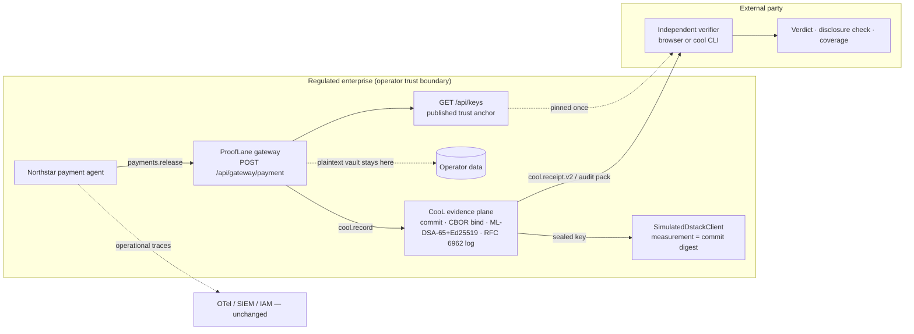

# ProofLane

**Independently verifiable, privacy-preserving execution receipts for consequential AI-agent actions — built on the [CooL SDK](https://github.com/Northwind-Cipher/cool-sdk) (`cool-nwc`).**

> The evidence does not have to come from a system you trust.

- **Live demo:** _VERCEL_URL_
- **Pitch:** _VERCEL_URL_/pitch.html
- **Docs:** [`docs/PRD.md`](docs/PRD.md) · [`docs/GTM.md`](docs/GTM.md) · [`docs/DESIGN.MD`](docs/DESIGN.MD)

---

## 1. The problem

AI agents now release payments, change beneficiaries, and modify access. When one of those actions is disputed six months later, the enterprise assembles traces, cloud audit logs, IAM records, and approval tickets. Two things go wrong:

1. **The reviewer must trust the operator.** Every log is controlled by the company being questioned — its backend, its exporter, its retention settings. An auditor, customer, insurer, or regulator has no way to check that the record wasn't changed.
2. **The raw evidence is too sensitive to hand over.** Tool arguments contain account numbers, customer identifiers, and prompts. OpenTelemetry and Microsoft Foundry tracing docs explicitly warn about this.

Meanwhile, EU AI Act Article 12 requires automatic event logging for high-risk AI, and only 22% of 500 senior legal/exec leaders are very confident they can produce governance evidence on demand (AAA/ICDR/IResearch). Existing observability answers *"here is our record"*. Nobody answers *"here is evidence you can check yourself."*

## 2. What we built

A working evidence gateway for one consequential action — **an AI agent releasing a $48,200 payment** — and the independent tooling to check it.

| Surface | What it does |
|---|---|
| **Control Room** (`/`) | The operator's view. The Northstar payment agent calls `payments.release`; the ProofLane gateway seals a CooL receipt *before* the release is reported (no receipt → no action). Shows the receipt with sensitive fields hidden, verifies it, selectively discloses the approval ID, then runs a real tamper attack ($48,200 → $4,820) and shows it fail. Exports a CooL audit pack, `receipt.json`, and `disclosure.json`. |
| **Independent verifier** (`/verifier`) | The auditor's view. Paste or upload a receipt **or an audit pack**, optionally a disclosure and pinned operator keys. All verification runs in the browser — no call to the operator backend. Exports a verification report. |
| **Gateway API** (`POST /api/gateway/payment`) | Node route handler: captures the action, calls `cool.record()`, returns receipt + operator-side plaintext vault + trust anchor + capture counters. |
| **Trust anchor** (`GET /api/keys`) | Published signing keys and deployment measurement, for a verifier to pin once (like a JWKS). |
| **Pitch** (`/pitch.html`) | Problem, why now, how it works, honest boundary, customer, business model, roadmap, risks. |

The receipts are real `cool.receipt.v2` objects — nothing in the verdicts is mocked. Attestation runs on the CooL simulator and is labelled `simulated` everywhere.

## 3. How CooL is used

CooL is not a decoration here; it *is* the evidence layer. Every trust claim the product makes is computed by the SDK.

| Product need | CooL API | Where |
|---|---|---|
| Capture the action at the tool boundary, committing input / output / approval without storing plaintext | `new CooL({ dstackClient })` · `cool.record({ type, metadata, payloads: { input, output, state }, software })` | [`src/lib/gateway.ts`](src/lib/gateway.ts), [`src/app/api/gateway/payment/route.ts`](src/app/api/gateway/payment/route.ts) |
| Stable, non-derivable signing key across serverless instances, bound to the deployed build | `SimulatedDstackClient({ appName, imageDigest: <git commit>, rootSeed: <secret> })` — key is sealed to the measurement | [`src/lib/gateway.ts`](src/lib/gateway.ts) |
| Publish trust material | `cool.ready()` · `cool.keyDirectory` · `cool.environment.measurement` | [`src/app/api/keys/route.ts`](src/app/api/keys/route.ts) |
| Offline verification with 7 structured domains (binding, ML-DSA-65 + Ed25519, RFC 6962 inclusion, witnesses, attestation, enclave, anchor) | `verifyEvidence(receipt, { expectedMeasurement })` | [`src/lib/trust.ts`](src/lib/trust.ts) — runs in the browser |
| Defeat key substitution (an attacker re-signing with their own key) | `withTrustedKeys(receipt, pinnedKeys)` + key-id pin check | [`src/lib/trust.ts`](src/lib/trust.ts) |
| Reveal only the approval ID | `disclose(receipt, "state", value)` · `verifyDisclosure(receipt, disclosure)` | [`src/app/page.tsx`](src/app/page.tsx), [`src/app/verifier/page.tsx`](src/app/verifier/page.tsx) |
| Real tamper attack | `saltedCommit(salt, tamperedInput)` rewrites the input commitment so the receipt still looks well-formed; the binding and hybrid signatures catch it | [`src/lib/receipt.ts`](src/lib/receipt.ts) |
| One file for the auditor | `buildAuditPack(receipts, { trustedKeys, enclave })` · `verifyAuditPack(pack)` · `coverage(receipts)` for EU AI Act / obligation mapping computed from receipts | Control Room export, verifier pack mode |
| Verify without our website at all | `cool` CLI: `npx -p cool-nwc cool verify receipt.json` | Step 6 of the Control Room |

### Why CooL matters for this use case

Without CooL, ProofLane would be another log exporter the reviewer has to trust. With it:

- **Integrity is checkable by a stranger.** Canonical CBOR binding + hybrid ML-DSA-65/Ed25519 signatures mean changing one byte — or one digit of the amount — fails verification.
- **Privacy is structural.** Salted commitments let the receipt travel to a counterparty while the account number and tool result never leave the operator.
- **Disclosure is precise.** The auditor asks for one field; they get exactly that field and can prove it's what was committed at capture time.
- **Honesty is enforced by the verifier, not by our UI.** A simulated quote can never be reported as a hardware pass.
- **Verification is portable.** Browser, CLI, or any other implementation of the format — no ProofLane account or backend required.

## 4. Architecture and workflow



1. The agent invokes the consequential tool; the gateway intercepts it.
2. CooL commits metadata, input (payment instruction), output (tool result), and state (approval ID) as salted hashes.
3. CooL canonicalizes to deterministic CBOR, computes the binding hash, signs with ML-DSA-65 + Ed25519, and appends to an RFC 6962 log.
4. The receipt returns; only then is the release reported (synchronous capture).
5. The receipt, audit pack, or `receipt.json` goes to the external party, who verifies offline — optionally against pinned operator keys and measurement.
6. On request the operator discloses one field; the verifier checks it against the original commitment.

## 5. Run it locally

Requirements: Node.js ≥ 20.

```bash
git clone https://github.com/charansaiponnada/prooflane-mvp.git
cd prooflane-mvp
npm install
npm run dev          # http://localhost:3000
```

Optional environment:

| Variable | Purpose |
|---|---|
| `COOL_SIM_ROOT_SEED` | Secret root seed for the simulated evidence plane. **Set this in any deployment** — without it the signing key is derived from a seed that is public in this repo. |

Checks:

```bash
npm test             # CooL round-trip: verify, disclose, tamper, audit pack, key substitution
npm run check        # TypeScript
npm run lint
npm run build
```

### Demo script (3 minutes)

1. Control Room → read the operational trace: *who controls this evidence?*
2. **Release $48,200 via ProofLane** → portable receipt, hidden fields, **Valid**, `simulated` badge.
3. **Disclose approval ID** → matches commitment.
4. **Change the amount** → **Invalid**: binding and signature fail; forged disclosure rejected.
5. **Open in independent verifier** → same verdict from bytes only; export the audit pack and verify it too.
6. Download `receipt.json` → `npx -p cool-nwc cool verify receipt.json`.

## 6. Technical decisions

- **One action, synchronous capture.** For consequence-bearing actions, a best-effort async queue is the wrong control (PRD FR-10). The gateway awaits `cool.record()` and fails closed.
- **Verification in the browser.** `cool-nwc/verify` and `cool-nwc/phala` have no Node-only imports, so the verifier ships to the client — the strongest way to show "no operator backend".
- **Approval ID as the `state` payload.** Disclosure opens exactly one committed value, so the approval ID gets its own commitment rather than being buried in metadata.
- **Injected `SimulatedDstackClient` with a secret seed and commit-derived image digest.** On serverless, every instance derives the same signing key (so keys can be pinned), nobody without the seed can forge it, and a new deploy changes the measurement and key — receipts are bound to the build that produced them.
- **Pinned trust is explicit.** Without pinned keys, a receipt is only self-consistent. The verifier says so ("not pinned") instead of implying more.
- **Real tamper, not a UI trick.** The attack recomputes a valid-looking commitment; detection comes from CooL's binding and signatures.
- **Design system.** shadcn/ui + Phosphor, strictly monochrome; color only for verified / invalid / simulated ([`docs/DESIGN.MD`](docs/DESIGN.MD)).

## 7. Limitations (honest boundary)

ProofLane proves **the integrity of a captured execution statement**. It does **not** prove that:

- the AI decision was correct, fair, safe, or legal;
- every relevant event was captured, or that the application didn't lie before capture;
- the workflow is compliant because a receipt is valid.

Demo-specific limits:

- **Simulated attestation.** No Intel TDX hardware; the quote chains to the CooL simulator root.
- **In-memory transparency log and counters.** Each serverless instance keeps its own log; inclusion proofs are per instance and reset on cold start.
- **No external witnesses or Bitcoin anchor.** Those domains report `absent`.
- **Synthetic data, one action class, no auth or persistence.**
- **Trust anchor served by the operator.** Fine for a demo; in production keys should be distributed out of band and rotated.
- Commitments are not encryption: low-entropy values can be guessed, and a disclosed field is disclosed permanently.

## 8. Future improvements

- Real dstack / Intel TDX deployment with `requireAttestation` and remote quote verification.
- Durable, shared transparency log with external witnesses (`attachWitness`, `witnessThreshold`) and OpenTimestamps anchoring.
- More action classes: beneficiary change, privileged access, fraud-case disposition.
- Policy-aware gating (`evaluate` / change records) for model, prompt, and permission changes.
- Key rotation and revocation, customer-controlled trust roots, air-gapped verifier build.
- OTel / SIEM correlation links from receipts to existing telemetry.
- Paid design-partner pilot measuring evidence-pack time, reconstruction time, and sensitive-data exposure.

## License

MIT — see [LICENSE](LICENSE). CooL SDK is Apache-2.0 by Northwind Cipher.
