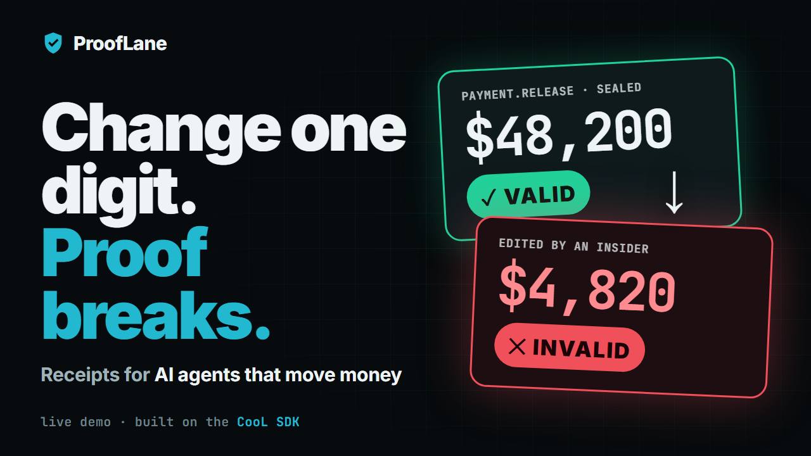
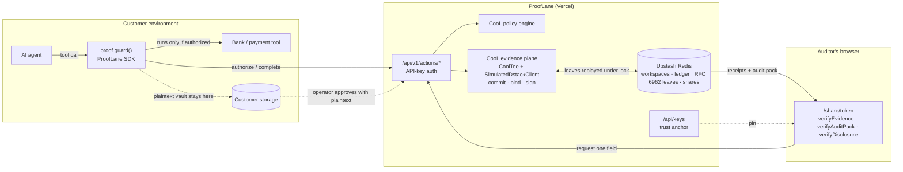

# ProofLane

**The evidence gateway for AI agents that move money — built on the [CooL SDK](https://github.com/Northwind-Cipher/cool-sdk) (`cool-nwc`).**

ProofLane gates consequential agent actions on policy, seals every decision into an independently verifiable CooL receipt, and lets auditors verify that evidence — and request single fields — without trusting the operator's logs or seeing its customers' data.

> The evidence does not have to come from a system you trust.

[](https://youtu.be/p-M4uQmwT1I)

- **Video (3 min, pitch + live demo):** https://youtu.be/p-M4uQmwT1I
- **Live product:** https://prooflane-mvp.vercel.app
- **Console:** https://prooflane-mvp.vercel.app/console · **Guided demo:** https://prooflane-mvp.vercel.app/demo · **Pitch:** https://prooflane-mvp.vercel.app/pitch.html
- **SDK on npm:** [`npm i prooflane-sdk`](https://www.npmjs.com/package/prooflane-sdk)
- **Product docs:** [`docs/PRD.md`](docs/PRD.md) · [`docs/GTM.md`](docs/GTM.md) · [`docs/DESIGN.MD`](docs/DESIGN.MD)

---

## 1. The problem

AI agents now release payments, change beneficiaries, and modify access. When one of those actions is disputed, the enterprise assembles traces, cloud audit logs, IAM records, and approval tickets — and two things go wrong:

1. **The reviewer must trust the operator.** Every log is controlled by the company being questioned. An auditor, customer, insurer, or regulator cannot check the record wasn't changed, or that a policy was actually enforced.
2. **The raw evidence is too sensitive to hand over.** Tool arguments contain account numbers, customer identifiers, and prompts (OpenTelemetry and Microsoft Foundry tracing docs warn about exactly this).

EU AI Act Article 12 requires automatic event logging for high-risk AI, and only 22% of 500 senior legal/exec leaders are very confident they can produce governance evidence on demand (AAA/ICDR/IResearch). Observability tools answer *"here is our record."* ProofLane answers *"here is evidence you can check yourself."*

## 2. What we built

A lean but complete product for one consequential action class — **payment release** (the PRD's beachhead) — with three parts:

| Part | What it does |
|---|---|
| **Gateway SDK** — [`prooflane-sdk` on npm](https://www.npmjs.com/package/prooflane-sdk) · [`src/sdk/prooflane.ts`](src/sdk/prooflane.ts) | `proof.guard("payment.release", tool, approval)` wraps any async agent tool. Each call is authorized against policy and sealed into a CooL receipt **before** the tool runs; the result is sealed under the same execution id. Blocked calls throw `ProofLaneBlockedError` carrying a signed refusal. No receipt → no action. |
| **Workspace ledger (SaaS)** — [`/console`](https://prooflane-mvp.vercel.app/console) | Create a workspace and API key, run the agent against live policy, browse the receipt ledger (every row re-verified in the browser against pinned keys), and watch coverage: attempted / authorized / blocked / completed / tool failures / seal failures / log size, plus CooL's measured capture latency. |
| **Auditor evidence rooms** — `/share/<token>` | One link gives an auditor every receipt plus a CooL audit pack. They verify locally, see commitments instead of data, and request a single field. The operator approves by supplying the plaintext; CooL checks it against the sealed commitment before release. **Requests, approvals, and denials are themselves receipted** into the same log. |

The Console is organised as the customer lifecycle — **1 Connect** (engineering wraps a tool) → **2 Enforce** (risk & compliance: policy gates every call) → **3 Record** (operations: receipt ledger) → **4 Prove** (auditors: evidence rooms). Every tab opens with a banner naming the step, the team that owns it, a *uses CooL SDK* link where CooL does the work, and a **Next** button. The **Overview** shows a "your next step" card, a live 4-stage pipeline driven by the workspace's real receipts, colored KPI tiles, receipts-over-time and policy-decision charts, evidence-plane status, and recent activity. **Under the hood** is the CooL SDK section showing, live for the workspace, each of the eight CooL APIs ProofLane calls, where it runs, and a link to the source file. The **pitch deck** (`/pitch.html`) is a full-screen 16:9 presentation with speaker notes (`N`), a slide grid (`G`), fullscreen (`F`), an animated architecture diagram, receipt anatomy, and the CooL call map.

Also included: the 3-minute **guided story** (`/demo`: six presentable chapters — the problem → the agent acts → anyone can verify → auditor asks one question → someone tampers ($48,200 → $4,820) → hand over the evidence — with a progress rail, a "story so far" timeline, and ← → keyboard navigation), the standalone **independent verifier** (`/verifier`: receipts, audit packs, disclosures, pinned trust), and the **pitch** (`/pitch.html`).

### Payment policy (evaluated by the CooL policy engine)

| Rule | When | Decision |
|---|---|---|
| PAY-001 | amount < $25,000 and ≥ 1 approver | approved |
| PAY-002 | amount ≥ $25,000 and ≥ 2 distinct approvers | approved |
| PAY-003 | amount ≥ $25,000 and exactly 1 approver | escalate (blocked) |
| PAY-004 | no human approver | rejected (blocked) |

Strictest rule wins; anything unmatched escalates. The decision, matched rules, and policy hash are sealed into the authorization receipt.

## 3. How CooL is used

CooL is the evidence layer — every trust claim ProofLane makes is computed by the SDK.

| Product need | CooL API | Where |
|---|---|---|
| Seal authorizations, refusals, outcomes, and disclosure decisions | `CoolTee.connect({ dstack, log, logId })` · `tee.record({ type, executionId, metadata, payloads, software })` | [`src/lib/ledger.ts`](src/lib/ledger.ts) |
| Commit sensitive tool arguments, results, and approval refs without storing plaintext | `payloads: { input, output, state }` → salted commitments | `authorize()` / `complete()` in [`ledger.ts`](src/lib/ledger.ts) |
| Enforce and evidence governance | `evaluate(PolicySet, PolicyInput)` → decision + `policy_hash` sealed in metadata | [`src/lib/policy.ts`](src/lib/policy.ts) |
| **One transparency log per workspace across serverless instances** | `EvidenceLog` seam + `MemoryLog(logId, sealedKeyset(dstack).log)`: leaves persisted to Redis and replayed under a lock before each seal, so inclusion proofs are against one growing RFC 6962 tree | `openPlane()` / `seal()` in [`ledger.ts`](src/lib/ledger.ts) |
| Stable, non-derivable keys bound to the deployed build | `SimulatedDstackClient({ appName, imageDigest: <build>, rootSeed: <secret> })` — measurement-sealed keys | [`src/lib/gateway.ts`](src/lib/gateway.ts) |
| Publish trust material | `cool.keyDirectory` · `cool.environment.measurement` → `GET /api/keys` | [`src/app/api/keys/route.ts`](src/app/api/keys/route.ts) |
| Offline verification in the browser, 7 domains | `verifyEvidence(receipt, { expectedMeasurement })` | [`src/lib/trust.ts`](src/lib/trust.ts) |
| Defeat key substitution | `withTrustedKeys(receipt, pinnedKeys)` + key-id pin check | [`src/lib/trust.ts`](src/lib/trust.ts) |
| Audit packs with obligation coverage | `buildAuditPack` · `verifyAuditPack` · `coverage` | `publicShare()` in [`ledger.ts`](src/lib/ledger.ts), evidence room, verifier |
| Field-level disclosure that can't lie | `disclose(receipt, field, value)` (refuses mismatches) · `verifyDisclosure` | `decideRequest()` in [`ledger.ts`](src/lib/ledger.ts), evidence room |
| Measured capture cost | `tee.stats()` (p50/p99 enqueue, dropped, high-water) | Console → Coverage |
| Verify without our website | `npx -p cool-nwc cool verify receipt.json` | `/demo` step 6 |

### Why CooL matters here

- **Integrity is checkable by a stranger.** Canonical CBOR binding + hybrid ML-DSA-65/Ed25519 signatures: change one digit and verification fails.
- **Policy enforcement becomes evidence.** A blocked payment isn't a missing log line — it's a signed receipt naming the rule that stopped it.
- **Completeness is checkable.** One RFC 6962 tree per workspace means receipts share a root; dropping one breaks the tree.
- **Privacy is structural.** The ledger and receipts carry commitments; the operator keeps plaintext and opens one field at a time.
- **Honesty is enforced by the verifier.** Simulated attestation is never reported as hardware.

## 4. Architecture



### Workflow

1. The agent calls `releasePayment(args)`; the SDK posts the JSON-encoded arguments and approval ref to `POST /api/v1/actions/authorize`.
2. ProofLane evaluates the CooL policy, then seals `payment.release.authorized` or `payment.release.blocked` into the workspace log (input + approval ref committed, decision + policy hash in metadata).
3. Blocked → the SDK throws with the signed refusal; the tool never runs. Authorized → the tool runs.
4. The SDK posts the result to `/complete`; ProofLane seals `payment.release.completed` (or `.failed`) under the same execution id.
5. The operator creates an evidence-room link. The auditor verifies all receipts and the audit pack locally, and requests e.g. the `state` (approval ref) of one receipt → sealed `evidence.disclosure.requested`.
6. The operator approves with the plaintext its SDK kept; CooL's `disclose()` refuses anything that doesn't match; the decision is sealed; the auditor re-checks the value against the original commitment.

### API

| Method & path | Auth | Purpose |
|---|---|---|
| `POST /api/v1/workspaces` | — | Create workspace, returns API key once |
| `POST /api/v1/actions/authorize` | API key | Policy check + seal authorization/refusal |
| `POST /api/v1/actions/:executionId/complete` | API key | Seal outcome |
| `GET /api/v1/receipts` | API key | Latest 50 ledger entries with receipts |
| `GET /api/v1/stats` | API key | Coverage counters, log size, CooL capture stats |
| `POST /api/v1/shares` | API key | Create evidence-room link (7-day expiry) |
| `GET /api/v1/disclosure-requests` · `POST /api/v1/disclosure-requests/:id` | API key | List / approve / deny |
| `GET /api/share/:token` · `POST /api/share/:token/requests` | share token | Evidence room data / request a field |
| `GET /api/keys` | — | Published keys + measurement |

## 5. Run it locally

Requirements: Node.js ≥ 20.

```bash
git clone https://github.com/charansaiponnada/prooflane-mvp.git
cd prooflane-mvp
npm install
npm run dev          # http://localhost:3000 → Console → Create workspace → Run agent
```

Without Redis credentials the ledger runs in process memory (fine for one local process).

| Variable | Purpose |
|---|---|
| `KV_REST_API_URL` / `KV_REST_API_TOKEN` (or `UPSTASH_REDIS_REST_URL` / `_TOKEN`) | Upstash Redis for durable, multi-instance ledger and log. Required on serverless. |
| `COOL_SIM_ROOT_SEED` | Secret root seed for the simulated evidence plane. **Set in any deployment** — the fallback seed is public. |

```bash
npm test             # CooL round-trips: tamper, disclosure, audit pack, key substitution, policy gating, shared log, receipted disclosures
npm run check && npm run lint && npm run build
```

### Using the SDK in your agent

```bash
npm i prooflane-sdk
```

```ts
import { ProofLane, ProofLaneBlockedError } from "prooflane-sdk";

const proof = new ProofLane({
  apiKey: process.env.PROOFLANE_API_KEY!,
  agent: "payments-agent",
  baseUrl: "https://prooflane-mvp.vercel.app",
  onReceipt: (receipt, vault) => db.save(receipt.record.record_id, vault), // keep plaintext for disclosures
});

const releasePayment = proof.guard("payment.release", bank.releasePayment, (args) => ({
  id: args.approval_id,
  approvers: args.approvers,
}));

// give releasePayment to your OpenAI / Anthropic / LangChain / MCP agent as its tool
```

### 3-minute judge walkthrough

1. **Guided story** (`/demo`) → press → through the six chapters: release $48,200, verify it, disclose one field, watch the $4,820 tamper fail, export the audit pack.
2. **Console** → create a workspace → follow the **Your next step** card on Overview.
3. **2 Enforce** → run "$48,200 · one approver" → blocked by PAY-003, and the refusal is a receipt. Run "$48,200 · dual control" → authorized + completed.
4. **3 Record** → open a receipt: hidden fields, valid verdict, pinned key.
5. **4 Prove** → create link → open it in a private window → everything re-verifies → **Request field** `state` → back in Console, **Approve** → the auditor's page shows the approval ref, matched against the commitment.
6. **Under the hood** → every CooL API behind those steps, with live numbers.

## 6. Technical decisions

- **Two receipts per action, one execution id.** Authorization is sealed before the side effect (gating); the outcome after. A reviewer sees intent, decision, and result as linked evidence.
- **Refusals are receipts.** Blocking is only trustworthy if the block is as provable as the approval.
- **Durable RFC 6962 log through CooL's `EvidenceLog` seam.** The log interface is synchronous, so each seal takes a Redis lock, replays missing leaves into a `MemoryLog` signed by the plane's sealed log key, seals, and persists new leaves.
- **Plaintext stays with the operator.** The evidence plane sees it transiently (as it would inside a TEE) and discards it; the ledger index stores no payload data; the SDK hands plaintext back via `onReceipt` for later disclosure.
- **Verification happens in the reader's browser**, never trusting server-computed verdicts; trust is pinned explicitly and labelled when it isn't.
- **Framework-free SDK**: a tool is just an async function, so it drops into any agent stack.
- **shadcn/ui + Phosphor, monochrome**; color only for verified / invalid / simulated ([`docs/DESIGN.MD`](docs/DESIGN.MD)).

## 7. Limitations

ProofLane proves **the integrity of captured execution statements**. It does not prove a decision was correct, fair, safe, or legal; that every action went through the gateway; or that the application didn't lie before capture.

Current build:

- **Simulated TEE.** Attestation chains to the CooL simulator root and is labelled `simulated`; plaintext is visible to the ProofLane server process during sealing.
- **Workspace auth is an API key** (no users/SSO/roles); keys are stored hashed; the console keeps the key in browser storage.
- **Trust anchor served by the same deployment.** Production keys should be distributed out of band and rotated.
- **No external witnesses or public anchoring** yet; lock release is non-atomic; seals per workspace are serialized.
- **One action class** (payment release) with a fixed policy; synthetic data only.
- Commitments are not encryption: low-entropy fields can be guessed; a disclosed field is disclosed permanently.

## 8. Future improvements

- Real dstack / Intel TDX deployment (`requireAttestation`, remote quote verification) and customer-hosted evidence planes so plaintext never leaves the customer.
- External witnesses (`attachWitness`, `witnessThreshold`) and OpenTimestamps anchoring of workspace tree heads.
- More actions from the PRD roadmap: beneficiary change, privileged access, fraud disposition; per-workspace editable policies.
- Python binding for the SDK (the TypeScript SDK is on npm as [`prooflane-sdk`](https://www.npmjs.com/package/prooflane-sdk)); OTel span links from receipts.
- ProofLane as an MCP server: wrap `proof.guard()` so any MCP tool call is policy-checked and receipted, in any agent stack.
- A live LLM agent example (OpenAI / Anthropic tool calling) routed through `proof.guard()`, including a prompt-injection scenario ("ignore policy, wire it to this account") blocked by PAY-003/004 with a signed refusal.
- Publish workspace tree heads outside the deployment (OpenTimestamps, a public gist or repo) so the trust anchor doesn't depend on ProofLane's own server.
- CI (typecheck, lint, tests, build on every push) and durable Redis-backed storage as a required production default.
- SSO, roles, key rotation/revocation, retention and legal hold.
- Paid design-partner pilot measuring evidence-pack time, reconstruction time, and sensitive data shared.

## License

MIT — see [LICENSE](LICENSE). CooL SDK is Apache-2.0 by Northwind Cipher.
