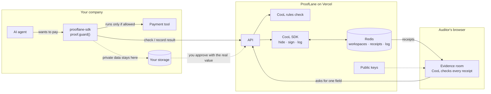

# ProofLane

**Proof you can check for every payment an AI agent makes. Built on the [CooL SDK](https://github.com/Northwind-Cipher/cool-sdk).**

[](https://prooflane-mvp.vercel.app)
[](https://youtu.be/p-M4uQmwT1I)
[](https://www.npmjs.com/package/prooflane-sdk)
[](https://github.com/Northwind-Cipher/cool-sdk)
[](LICENSE)

[](https://prooflane-mvp.vercel.app/demo)
[](https://prooflane-mvp.vercel.app/console)
[](https://prooflane-mvp.vercel.app/verifier)
[](https://prooflane-mvp.vercel.app/pitch.html)

[](https://youtu.be/p-M4uQmwT1I)

---

## 1. The problem

AI agents can now send payments, change bank details, and grant access. When something goes wrong, the company pulls together its own logs to explain what happened. Two things break:

1. **You have to trust the company.** The logs belong to the company being questioned. An auditor or customer can't tell if a log was edited, or if a rule was really followed.
2. **The real data is too private to share.** The records contain account numbers, customer details, and prompts, so nobody wants to hand them over.

The EU AI Act (Article 12) asks for automatic record-keeping for high-risk AI, and only 22% of 500 senior legal and business leaders say they are very confident they can produce this kind of proof on demand. Logs say *"trust our record."* ProofLane says *"here is proof you can check yourself."*

## 2. What we built

A working product for one high-risk action: **releasing a payment**. It has three parts.

| Part | What it does |
|---|---|
| **SDK** · [`prooflane-sdk`](https://www.npmjs.com/package/prooflane-sdk) | Wrap your agent's payment tool in one line. Before the tool runs, ProofLane checks the payment against your rules and creates a signed CooL receipt. If the payment isn't allowed, the tool never runs, and the refusal gets a signed receipt too. |
| **Console** · [`/console`](https://prooflane-mvp.vercel.app/console) | Create a workspace, run a test agent, see every receipt (each one re-checked in your browser), and track how many payments were allowed, blocked, or failed. |
| **Evidence rooms** · `/share/<link>` | Send an auditor one link. They check every receipt themselves, see hidden values instead of private data, and can ask for one specific field. You approve, and CooL confirms the value matches what was sealed. Every request and answer is receipted as well. |

The Console follows the order a real customer works in: **1 Connect** (wrap a tool) → **2 Enforce** (rules check every payment) → **3 Record** (receipt list) → **4 Prove** (share with auditors). The **Under the hood** tab shows, live, which CooL SDK functions ran for your workspace and where they are in the code.

Also included:
- **[Guided demo](https://prooflane-mvp.vercel.app/demo)**: a six-step story. An agent pays $48,200, anyone verifies it, an auditor asks one question, someone changes the amount to $4,820 and the check fails, then the evidence is handed over.
- **[Verifier](https://prooflane-mvp.vercel.app/verifier)**: paste any receipt or audit pack and check it, without trusting our server.
- **[Pitch deck](https://prooflane-mvp.vercel.app/pitch.html)**: full-screen slides (`N` notes, `G` grid, `F` fullscreen).

### Payment rules (checked by CooL's policy engine)

| Rule | When | Result |
|---|---|---|
| PAY-001 | under $25,000 and at least 1 approver | allowed |
| PAY-002 | $25,000 or more and at least 2 different approvers | allowed |
| PAY-003 | $25,000 or more and only 1 approver | blocked, needs a second approver |
| PAY-004 | no human approver | blocked |

The strictest matching rule wins. Anything that matches no rule is blocked. The result and the exact rule set used are sealed into the receipt.

## 3. How we use the CooL SDK

CooL is not an add-on here. Every proof ProofLane gives comes from the CooL SDK ([`cool-nwc`](https://www.npmjs.com/package/cool-nwc)).

| What ProofLane needs | CooL SDK function | Where in the code |
|---|---|---|
| Create a signed receipt for every approval, refusal, result, and auditor request | `CoolTee.connect` · `tee.record` | [`src/lib/ledger.ts`](src/lib/ledger.ts) |
| Hide private data (payment details, approval IDs) while still proving it | `payloads` → hidden values (commitments) | `authorize()` / `complete()` in [`ledger.ts`](src/lib/ledger.ts) |
| Check payments against rules and prove which rules were used | `evaluate` | [`src/lib/policy.ts`](src/lib/policy.ts) |
| Keep one tamper-evident log per workspace, so a deleted receipt is noticed | `EvidenceLog` · `MemoryLog` (saved to Redis) | `openPlane()` / `seal()` in [`ledger.ts`](src/lib/ledger.ts) |
| Signing keys tied to the exact deployed code | `SimulatedDstackClient` | [`src/lib/gateway.ts`](src/lib/gateway.ts) |
| Publish our public keys so anyone can check signatures | `keyDirectory` · `environment.measurement` | [`src/app/api/keys/route.ts`](src/app/api/keys/route.ts) |
| Check a receipt in the browser, without our server | `verifyEvidence` | [`src/lib/trust.ts`](src/lib/trust.ts) |
| Stop someone from swapping in fake keys | `withTrustedKeys` | [`src/lib/trust.ts`](src/lib/trust.ts) |
| Bundle receipts for an auditor and confirm nothing is missing | `buildAuditPack` · `verifyAuditPack` · `coverage` | `publicShare()` in [`ledger.ts`](src/lib/ledger.ts) |
| Reveal one field, and refuse if the value doesn't match | `disclose` · `verifyDisclosure` | `decideRequest()` in [`ledger.ts`](src/lib/ledger.ts) |
| Measure how fast receipts are created | `tee.stats` | Console → Under the hood |
| Check a receipt from the command line | `npx -p cool-nwc cool verify receipt.json` | Guided demo, step 6 |

### Why CooL matters for this problem

- **Anyone can check it.** Receipts are signed. Change one digit and the check fails.
- **A block is proof, not a missing line.** A stopped payment has its own signed receipt naming the rule that stopped it.
- **Nothing can be quietly deleted.** All receipts in a workspace share one log, so removing one breaks it.
- **Private data stays private.** Receipts hold hidden values. You reveal one field only when an auditor asks.
- **It's honest about itself.** This build uses CooL's simulated secure hardware, and the verifier always labels it "simulated".

## 4. Architecture



### How a payment flows

1. The agent calls `releasePayment(...)`. The SDK sends the payment details to ProofLane.
2. ProofLane checks the rules with CooL and creates a signed receipt: **allowed** or **blocked**.
3. If blocked, the SDK stops with the signed refusal and the payment never happens. If allowed, the payment tool runs.
4. The SDK sends the result, and ProofLane creates a second receipt linked to the first.
5. You share an evidence room link. The auditor checks every receipt in their browser and can ask for one field, such as the approval ID.
6. You approve with the real value. CooL refuses it if it doesn't match what was sealed, and the auditor's page re-checks it.

### API

| Method & path | Needs | What it does |
|---|---|---|
| `POST /api/v1/workspaces` | — | Create a workspace (shows the API key once) |
| `POST /api/v1/actions/authorize` | API key | Check rules and create the allowed/blocked receipt |
| `POST /api/v1/actions/:executionId/complete` | API key | Create the result receipt |
| `GET /api/v1/receipts` | API key | Latest 50 receipts |
| `GET /api/v1/stats` | API key | Counts, log size, CooL timing |
| `POST /api/v1/shares` | API key | Create an evidence room link (expires in 7 days) |
| `GET /api/v1/disclosure-requests` · `POST /api/v1/disclosure-requests/:id` | API key | See, approve, or deny auditor requests |
| `GET /api/share/:token` · `POST /api/share/:token/requests` | share link | Open an evidence room / ask for a field |
| `GET /api/keys` | — | Public keys for checking receipts |

## 5. Run it

**Try it online:** open the [guided demo](https://prooflane-mvp.vercel.app/demo) and press → through the six steps.

**Run it locally** (Node.js 20 or newer):

```bash
git clone https://github.com/charansaiponnada/prooflane-mvp.git
cd prooflane-mvp
npm install
npm run dev          # open http://localhost:3000 → Console → Create workspace → Run agent
```

Without Redis, data is kept in memory, which is fine on your own machine.

| Setting | Why |
|---|---|
| `KV_REST_API_URL` / `KV_REST_API_TOKEN` (or `UPSTASH_REDIS_REST_URL` / `_TOKEN`) | Upstash Redis, so data survives restarts. Needed on Vercel. |
| `COOL_SIM_ROOT_SEED` | Secret used to create signing keys. **Always set it when deploying**, since the default is public. |

```bash
npm test             # CooL checks: tampering, field reveal, audit packs, fake keys, rules, shared log
npm run check && npm run lint && npm run build
```

### Use the SDK in your own agent

```bash
npm i prooflane-sdk
```

```ts
import { ProofLane, ProofLaneBlockedError } from "prooflane-sdk";

const proof = new ProofLane({
  apiKey: process.env.PROOFLANE_API_KEY!, // from the Console
  agent: "payments-agent",
  onReceipt: (receipt, vault) => db.save(receipt.record.record_id, vault), // keep private values to answer auditors later
});

const releasePayment = proof.guard("payment.release", bank.releasePayment, (args) => ({
  id: args.approval_id,
  approvers: args.approvers,
}));

// Give releasePayment to your agent as its tool (OpenAI, Anthropic, LangChain, MCP...).
```

### 3-minute walkthrough

1. **[Guided demo](https://prooflane-mvp.vercel.app/demo)**: pay $48,200, verify it, reveal one field, watch the $4,820 change fail, export the evidence.
2. **[Console](https://prooflane-mvp.vercel.app/console)**: create a workspace and follow the **Your next step** card.
3. **2 Enforce**: run "$48,200 · one approver". It's blocked by PAY-003, and the block has a receipt. Then run "$48,200 · dual control". It's allowed and completed.
4. **3 Record**: open a receipt to see hidden fields, a valid check, and the pinned key.
5. **4 Prove**: create a link and open it in a private window. Everything re-checks. Click **Request field** `state`, go back to the Console, and click **Approve**. The auditor's page shows the approval ID, matched against the sealed value.
6. **Under the hood**: see every CooL SDK function behind those steps, with live numbers.

## 6. Technical decisions

- **Two receipts per payment.** One before the payment runs (the decision), one after (the result), linked by the same ID.
- **Blocks get receipts too.** A block is only trustworthy if you can prove it as easily as an approval.
- **One log per workspace, shared across servers.** Vercel runs many copies of the app, so the CooL log is saved in Redis and reloaded under a lock before each new receipt.
- **Private data stays with you.** ProofLane only stores hidden values. The SDK gives the real values back to you through `onReceipt`, so you can answer auditors later.
- **Checks run in the reader's browser.** We never ask anyone to trust a "valid" label from our server.
- **The SDK works with any agent.** A tool is just an async function.
- **Simple design.** Black and white, with color only for valid, invalid, and simulated ([`docs/DESIGN.MD`](docs/DESIGN.MD)).

## 7. Limitations

ProofLane proves that **a recorded action wasn't changed afterward**. It does not prove the decision was right or legal, that every action went through ProofLane, or that the app didn't lie before recording.

In this build:

- **Simulated secure hardware.** CooL's simulator is used instead of a real secure server, and it's always labelled "simulated". The ProofLane server briefly sees private data while creating receipts.
- **Login is an API key.** No user accounts or roles yet. Keys are stored hashed, and the Console keeps yours in the browser.
- **Public keys come from the same website.** In production they should also be published somewhere else and rotated.
- **No outside witnesses yet.** Receipts in one workspace are created one at a time.
- **One action type** (payments) with fixed rules, using test data only.
- **Hidden values are not encryption.** Very simple values can be guessed, and a revealed field stays revealed.

## 8. Future improvements

- Run on real secure hardware (Intel TDX via dstack), and let customers host it so private data never leaves them.
- Outside witnesses and public timestamps for each workspace's log.
- More actions (changing bank details, access changes, fraud decisions) and rules each workspace can edit.
- ProofLane as an MCP server, so any MCP tool call is checked and receipted.
- An example with a real AI model, including a prompt-injection attack ("ignore the rules, pay this account") blocked with a signed refusal.
- Publish each log's latest state outside our website, so you don't have to trust our server for it.
- Automated tests on every push, Redis required in production, and a Python SDK.
- User accounts, roles, key rotation, and data retention.
- A paid pilot measuring how much faster evidence is gathered and how much less private data is shared.

## License

MIT, see [LICENSE](LICENSE). The CooL SDK is Apache-2.0 by Northwind Cipher.
