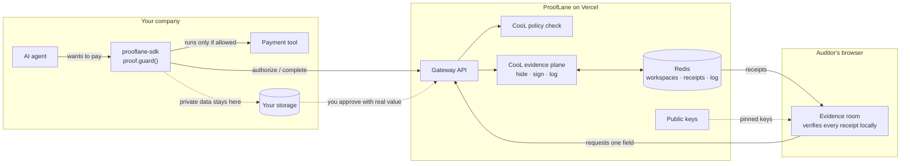

# ProofLane — Product Documentation

*Plain-English guide: what it is, why it exists, how it works, and where it's going.*

---

## 1. The story: why this exists

AI agents are starting to move money on their own — approve payments, change bank details, grant access. When one of those actions gets disputed, the company under question is the one who produces the evidence: its own logs, its own traces, its own story.

That creates two problems at once:

1. **You have to trust the accused.** Logs live inside the company's systems. Nobody outside can tell if a line was edited, deleted, or never written in the first place.
2. **The real evidence is too sensitive to hand over.** Payment amounts, account numbers, customer identifiers, and prompts sit inside those logs — nobody wants to export that to an auditor's inbox.

Regulation is closing in on this gap: EU AI Act Article 12 requires automatic event logging for high-risk AI systems, and only 22% of senior legal/exec leaders say they're confident they could produce that evidence today. 97% of orgs that had an AI-related breach lacked proper AI access controls (IBM/Ponemon).

**ProofLane's answer:** stop asking people to trust your logs. Give them a cryptographic receipt, generated at the moment the action happens, that they can verify themselves — without touching your backend or seeing the sensitive data underneath. Logs say "trust our record." ProofLane says "here is proof you can check yourself."

That receipt system is the **CooL SDK** (`cool-nwc`), an evidence/attestation library. ProofLane is CooL applied to one concrete, high-stakes case: **an AI agent releasing a payment.**

---

## 2. What ProofLane is, in plain English

ProofLane is a small piece of code (`prooflane-sdk`) you wrap around your AI agent's payment tool, plus a hosted service that checks each payment against your rules and hands back a signed, independently-verifiable receipt — for every approval *and* every refusal.

Think of it like a notary that stands next to your agent: before the agent is allowed to pay, the notary checks the rules and stamps a tamper-evident receipt. If the rules say no, the agent never touches the money, and the "no" gets stamped too. Anyone holding a receipt — an auditor, a regulator, a customer — can check it's genuine using nothing but public keys, without ever calling ProofLane's servers or seeing the private data inside.

It is **not** a fraud-detection engine, a general observability tool, or a claim that decisions are correct — it only proves that a recorded action wasn't altered after the fact, and that the stated rule was the one actually applied.

### The three parts

| Part | What it does |
|---|---|
| **SDK** (`prooflane-sdk`, npm) | `proof.guard()` wraps any agent tool function. Runs a policy check and creates a signed CooL receipt *before* the tool executes; execution only happens if authorized; the outcome gets a second, linked receipt. |
| **Console** (`/console`) | Create a workspace, run a test agent, watch every receipt get independently re-verified in your own browser, and see coverage/refusal stats. Follows a 4-step flow: **Connect → Enforce → Record → Prove.** |
| **Evidence rooms** (`/share/<link>`) | A single link you send an auditor. They verify every receipt themselves, see redacted (hashed) values instead of raw data, and can request one specific field be disclosed — which you approve, and CooL checks the disclosed value against what was originally sealed. |

### The payment rules (enforced by CooL's policy engine)

| Rule | Condition | Result |
|---|---|---|
| PAY-001 | < $25,000, ≥1 approver | allowed |
| PAY-002 | ≥ $25,000, ≥2 distinct approvers | allowed |
| PAY-003 | ≥ $25,000, only 1 approver | blocked — needs dual control |
| PAY-004 | no human approver | blocked |

Strictest matching rule wins; anything unmatched is blocked. The decision *and* the exact rule set used are sealed into the receipt — so a block is not a missing log line, it's a signed statement naming the rule that stopped it.

---

## 3. How it works (the flow)

**Authorize → Seal → Execute → Prove**

1. The agent calls its payment tool (wrapped by the SDK). The SDK sends the details to ProofLane.
2. ProofLane evaluates the CooL policy and creates a signed receipt: allowed or blocked.
3. If blocked, the SDK stops right there — the payment never runs, and the refusal is the proof.
4. If allowed, the tool executes; the SDK reports the result, and ProofLane seals a second receipt under the same execution ID.
5. You send an evidence-room link to an auditor. They verify every receipt in their own browser (nothing is trusted from ProofLane's server).
6. The auditor can request one specific field (e.g. the approval ID). You approve with the real value; CooL rejects it if it doesn't match what was originally committed to.

### What's actually inside a receipt (`cool.receipt.v2`)

- **Visible** — what happened, which software, which execution ID.
- **Committed, not included** — salted SHA-256 hashes of arguments, approval refs, policy decision. The raw values never leave your environment.
- **Signed** — a canonical CBOR binding, signed with both ML-DSA-65 (post-quantum) and Ed25519 (classical) — both must verify.
- **Provable in the log** — an RFC 6962 Merkle inclusion proof against a signed tree head, one log per workspace, so nothing can be silently deleted.
- **Attestation** — a quote structure tied to the signing key, honestly labeled `simulated` (see Limitations).

---

## 4. Architecture

Three trust zones. Verification always happens on the *reader's* side, never on ProofLane's say-so.



- **Customer environment** — the SDK sits next to your agent's tool; private data never leaves here except as hashed commitments.
- **ProofLane (Vercel)** — runs the CooL policy engine and evidence plane, keeps one tamper-evident transparency log per workspace in Redis.
- **Auditor's browser** — pins ProofLane's published keys and verifies receipts locally. It never trusts a "valid" verdict computed by ProofLane's server.

### API surface

| Method & path | Auth | Purpose |
|---|---|---|
| `POST /api/v1/workspaces` | — | Create a workspace (API key shown once) |
| `POST /api/v1/actions/authorize` | API key | Policy check + allow/block receipt |
| `POST /api/v1/actions/:executionId/complete` | API key | Result receipt |
| `GET /api/v1/receipts` | API key | Latest 50 receipts |
| `GET /api/v1/stats` | API key | Counts, log size, CooL timing |
| `POST /api/v1/shares` | API key | Create an evidence-room link (7-day expiry) |
| `GET/POST /api/v1/disclosure-requests` | API key | View / approve / deny field requests |
| `GET /api/share/:token`, `POST /api/share/:token/requests` | share link | Open evidence room / request a field |
| `GET /api/keys` | — | Public keys for independent verification |

### Tech spec

| Area | Detail |
|---|---|
| Evidence SDK | `cool-nwc` 3.0 · Node ≥ 20 · verifier runs in-browser |
| Receipt formats | `cool.receipt.v2` · `audit-pack.v2` · `disclosure.v1` |
| Commitments | Salted SHA-256, 16-byte salt per field |
| Canonicalization | Deterministic CBOR (RFC 8949 CDE) |
| Signatures | ML-DSA-65 (FIPS 204) + Ed25519 — both must verify |
| Transparency | RFC 6962 Merkle log + signed tree head, per workspace |
| Attestation | dstack / TDX quote structure · **simulated root** |
| Policy | CooL `evaluate()` · strictest rule wins · policy hash sealed |
| App | Next.js 16 App Router · React 19 · TypeScript |
| Data & hosting | Upstash Redis · Vercel serverless |
| Quality | Vitest CooL round-trip tests · ESLint · tsc |

---

## 5. Why the CooL SDK specifically

ProofLane is a thin application built entirely on top of `cool-nwc`. Without CooL, it's just another log exporter that still asks you to trust the exporter. Every trust property ProofLane offers traces back to a specific CooL API:

| Need | CooL function | Where |
|---|---|---|
| Signed receipt for every approval/refusal/result/request | `CoolTee.connect`, `tee.record` | `src/lib/ledger.ts` |
| Hide private data while still proving it | `payloads` → commitments | `authorize()`/`complete()` in `ledger.ts` |
| Check payments against rules, prove which rules ran | `evaluate` | `src/lib/policy.ts` |
| Tamper-evident log per workspace | `EvidenceLog`/`MemoryLog` (→ Redis) | `openPlane()`/`seal()` in `ledger.ts` |
| Keys tied to deployed code | `SimulatedDstackClient` | `src/lib/gateway.ts` |
| Publish keys for independent checking | `keyDirectory`, `environment.measurement` | `src/app/api/keys/route.ts` |
| Verify in-browser, no server trust | `verifyEvidence` | `src/lib/trust.ts` |
| Reject substituted/fake keys | `withTrustedKeys` | `src/lib/trust.ts` |
| Bundle + confirm nothing missing for an auditor | `buildAuditPack`, `verifyAuditPack`, `coverage` | `publicShare()` in `ledger.ts` |
| Reveal one field, refuse mismatches | `disclose`, `verifyDisclosure` | `decideRequest()` in `ledger.ts` |

This gives ProofLane properties a stranger can actually check:
- **Integrity** — one changed digit fails the binding hash and both signatures.
- **Enforcement is evidence** — a refusal is a signed receipt naming the rule.
- **Completeness is checkable** — every receipt shares one RFC 6962 root.
- **Privacy is structural** — commitments travel, plaintext stays with the operator.
- **Key substitution is caught** — pinned keys via `withTrustedKeys`.
- **Honesty is enforced** — simulated attestation is never reported as real hardware.

---

## 6. About the CooL SDK itself

ProofLane doesn't reimplement any of this — it's a consumer of the [`cool-nwc`](https://github.com/Northwind-Cipher/cool-sdk) package (Apache-2.0, Northwind Cipher Pvt. Ltd., currently v3.0.0). Straight from the CooL repo:

> **CooL — Cryptographic Observability & On-chain Ledger.** Tamper-evident, offline-verifiable evidence about what your software actually did — without storing what it did it to.

CooL is a general-purpose evidence SDK; ProofLane is one application of it (payments). Your app calls `cool.record()`; CooL hands back a self-contained receipt anyone can verify later — offline, no account, no trust in CooL — proving:

- **which software ran** (name, version, content digest)
- **which event happened** (a dotted type plus a salted commitment to your metadata)
- **that the record is unforged** — a hybrid post-quantum + classical signature over a deterministic commitment
- **that it's in an append-only log** — an RFC 6962 inclusion proof under a signed tree head
- **where it ran**, when inside a TEE — the enclave measurement and a quote bound to the signing key

Pipeline: `OBSERVE → COMMIT → SIGN → ATTEST → ANCHOR → VERIFY`. CooL records *what happened* — it does not grade it; nothing in CooL proves an output was correct, fair, or safe.

**Why it exists (from the CooL README):** AI and regulated systems increasingly have to answer questions after the fact — what software executed, which version, in what environment, was the record modified, was it produced in a trusted environment, and can someone else verify it without our logs or our data? A log line answers none of these, because a log can be edited and a screenshot proves nothing. CooL turns each of those into a checkable statement.

**Security posture:** *fail-open toward your application, fail-closed toward verification* — if the transparency service is down, your app keeps running; the verifier never reports success on a check it couldn't perform. Its own threat table:

| Threat | CooL defense | Residual risk |
|---|---|---|
| Evidence modified after the fact | binding hash + hybrid signature over canonical CBOR | signing-key compromise |
| Replaying an old record | `execution_id` + `record_id` (ULID) + monotone `seq` + `issued_at` | policy-dependent freshness window |
| Substituting the signer | signature bound to a `key_id` in the receipt's key directory | key-directory trust/management |
| Claiming a run happened in a TEE | measurement + quote digest inside the signed core | TEE hardware assumptions |
| Stapling a valid quote onto another record | quote `report_data` commits to the signing key | — |
| Editing the transparency log | RFC 6962 inclusion + consistency proofs | root trust; no external witnesses in this build |
| Simulator passed off as hardware | `mode: "simulated"` in every receipt; verifier never returns `pass` on it | operator disables the policy |

CooL explicitly does **not** protect against compromised application logic producing valid evidence of the wrong thing, TEE hardware vulnerabilities, incorrect trust roots, or a compromised dependency.

**Package shape:** ESM, Node ≥ 20, no native build step, no postinstall scripts, no network calls at install or runtime. Exports: `cool-nwc` (core + `CooL`, `verifyEvidence`), `cool-nwc/verify` (standalone verifier), `cool-nwc/phala` (advanced tier: `CoolTee`, dstack clients, quote/anchor/witness/policy/disclosure — what ProofLane actually imports), `cool-nwc/node` (filesystem log, unix-socket transport), `cool-nwc/tee` (everything). Ships a `cool` CLI (`cool verify`, `cool doctor`, `cool walkthrough`, `cool seal`, `cool pack build`, `cool disclose`).

**CooL's own roadmap:** shipped — evidence records, hybrid signatures, RFC 6962 log, offline verifier, dstack (HTTP + simulator), TDX quote structure, OpenTimestamps anchor, CLI. Experimental — remote quote verification against Intel DCAP collateral, Bitcoin anchor confirmation. Planned — external transparency witnesses/gossip, NVIDIA confidential-GPU verification, additional TEE vendors, a hosted verifier service, a published JSON Schema for `cool.evidence.v1`.

---

## 7. Try it

- **Guided demo** — `/demo`: a $48,200 payment, one approver → blocked; dual control → authorized; evidence shared; amount tampered to $4,820 → verification fails.
- **Console** — `/console`: Connect → Enforce → Record → Prove, with an "Under the hood" tab showing live CooL calls.
- **Verifier** — `/verifier`: paste any receipt or audit pack and check it without trusting ProofLane's server.
- **SDK usage:**

```ts
import { ProofLane, ProofLaneBlockedError } from "prooflane-sdk";

const proof = new ProofLane({
  apiKey: process.env.PROOFLANE_API_KEY!,
  agent: "payments-agent",
  onReceipt: (receipt, vault) => db.save(receipt.record.record_id, vault),
});

const releasePayment = proof.guard("payment.release", bank.releasePayment, (args) => ({
  id: args.approval_id,
  approvers: args.approvers,
}));

// Give releasePayment to your agent as its tool (OpenAI, Anthropic, LangChain, MCP...).
```

---

## 8. Business model & who buys it

**Motion:** paid design-partner pilot — one action (payments), 8–12 weeks, mid-sized fintechs (not tier-one banks first).

| Role | Who |
|---|---|
| Economic buyer | CISO · Head of AI Platform · CRO · Model Risk · Internal Audit |
| Technical champion | AI platform / security engineering lead |
| Evidence consumer | Audit · compliance · legal · fraud investigation — must be in the room from day one |

**What the pilot measures:**
- Evidence-pack preparation time ↓
- Systems manually correlated ↓
- Sensitive fields shared ↓
- Receipt loss on the sync path = 0
- Evidence consumer accepts the proof — and pays

We sell *reduced evidence cost*, never "hashes."

---

## 9. Honest limitations

ProofLane proves the integrity of a *captured* execution statement. It does **not** prove:
- the decision was correct, fair, or legal
- every action actually went through ProofLane
- the app didn't misrepresent something before recording it

Specific to this build:
- **Simulated secure hardware.** CooL's simulator stands in for real confidential computing; the verifier always labels it `simulated`. The server briefly sees private data while creating receipts.
- **Login is an API key** — no accounts/roles yet.
- **Public keys are served from the same website** they protect — should be published elsewhere and rotated in production.
- **No external witnesses yet** — receipts within a workspace are created serially.
- **One action type** (payments), fixed rules, test data only.
- **Hidden values aren't encryption** — simple values can be guessed, and a disclosed field stays disclosed.

---

## 10. Research grounding

- **EU AI Act, Article 12** — mandates automatic event logging and traceability for high-risk AI systems.
- **AAA/ICDR · IResearch survey** — only 22% of 500 senior legal/exec leaders are very confident they can produce AI governance evidence on demand.
- **IBM / Ponemon (600 orgs)** — 97% of organizations with an AI-model breach lacked proper AI access controls; 60% of AI-related incidents compromised data, 31% disrupted operations.
- **OpenTelemetry / Microsoft Foundry tracing docs** — explicitly flag tool-call arguments (account numbers, customer identifiers, prompts) as sensitive fields, motivating commitment-based redaction over raw log export.

## 11. Roadmap

| Stage | Focus |
|---|---|
| **Now** | SDK · policy gating · workspace ledger · evidence rooms |
| **Pilot** | Customer-hosted evidence plane · editable policies · SSO |
| **Production** | Real TDX quotes · external witnesses · key rotation |
| **Expansion** | More action types (beneficiary changes, privileged access, fraud decisions), ProofLane as an MCP server, Python SDK, automated CI, prompt-injection demo, account/role management |

---

*Sources: `README.md`, `src/app/(deck)/pitch/deck.tsx` (pitch deck), `docs/PRD.md`, `docs/GTM.md`, `docs/DESIGN.MD`, and `packages/sdk`.*
